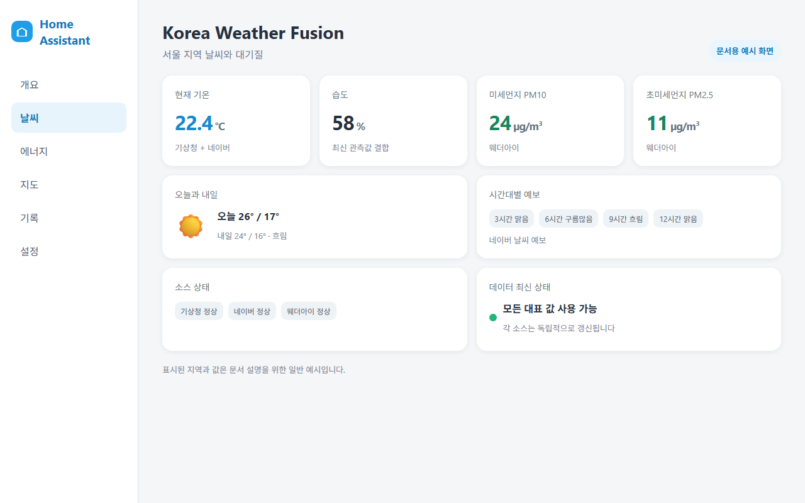
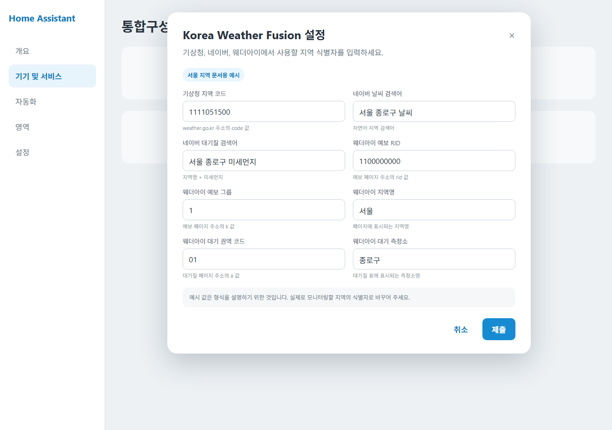

# Korea Weather Fusion

## 한국어

Korea Weather Fusion은 대한민국 날씨와 대기질 정보를 Home Assistant에서 한눈에
볼 수 있도록 기상청, 네이버 날씨, 웨더아이의 정보를 결합하는 사용자 지정
통합구성요소입니다.

### 주요 기능

- 현재 기온·습도·풍속은 사용할 수 있는 최신 소스를 결합합니다.
- 미세먼지와 오늘·내일 최고/최저기온은 최신성과 우선순위에 따라 선택합니다.
- 3·6·9·12시간 후의 네이버 날씨 예보를 제공합니다.
- 기상청, 네이버, 웨더아이 원본 값을 별도 진단 엔티티로 확인할 수 있습니다.
- 한 소스에 일시적인 문제가 생겨도 다른 정상 소스의 값은 계속 사용합니다.
- 웨더아이의 마지막 정상 정보는 Home Assistant 재시작 후에도 유효 시간 동안
  사용할 수 있습니다.
- 모든 지역 정보는 설정 화면에서 입력하고 나중에 변경할 수 있습니다.

### 요구 사항

- Home Assistant 2026.3.0 이상
- 대한민국 지역에 해당하는 각 제공처의 지역 식별자
- 기상청, 네이버, 웨더아이 웹사이트에 접속할 수 있는 네트워크

API 키나 별도 계정은 필요하지 않습니다.

### 설치

#### HACS 사용자 지정 저장소

1. HACS에서 **사용자 지정 저장소**를 엽니다.
2. `https://github.com/mahlernim/korea-weather-fusion`을 추가하고 유형으로
   **Integration**을 선택합니다.
3. Korea Weather Fusion을 다운로드하고 Home Assistant를 다시 시작합니다.
4. **설정 > 기기 및 서비스 > 통합구성요소 추가 > Korea Weather Fusion**을
   선택합니다.

#### 수동 설치

이 저장소의 `custom_components/weather_fusion` 폴더를 Home Assistant의 같은
경로에 복사한 뒤 Home Assistant를 다시 시작합니다.

### 처음 설정하기

설정 화면에서 다음 값을 입력합니다. 아래 검색어와 숫자는 형식을 보여 주는
일반적인 예시이며, 실제로 사용할 지역에 맞게 바꾸어야 합니다.

| 항목 | 입력 내용 | 예시 |
|---|---|---|
| 기상청 지역 코드 | weather.go.kr 현재 날씨 주소의 `code` 값 | `1111051500` |
| 네이버 날씨 검색어 | 네이버 날씨 검색에 사용할 지역명 | `서울 종로구 날씨` |
| 네이버 대기질 검색어 | 지역명과 미세먼지를 포함한 검색어 | `서울 종로구 미세먼지` |
| 웨더아이 예보 RID | 지역 예보 주소의 `rid` 값 | `1100000000` |
| 웨더아이 예보 그룹 | 같은 주소의 `k` 값 | `1` |
| 웨더아이 지역명 | 예보 페이지에 표시되는 지역명 | `서울` |
| 웨더아이 대기 권역 코드 | 대기질 주소의 `a` 값 | `01` |
| 웨더아이 대기 측정소 | 대기질 표에 표시되는 측정소명 | `종로구` |

설치 후 지역을 바꾸려면 **설정 > 기기 및 서비스 > Korea Weather Fusion > 구성**을
선택합니다. 지역을 변경해도 기존 Korea Weather Fusion 엔티티 ID는 유지됩니다.

### 제공 엔티티

기본 엔티티에는 통합 기온, 습도, 풍속, 미세먼지, 초미세먼지, 오늘·내일
최고/최저기온, 시간대별 텍스트 예보와 데이터 최신 상태가 포함됩니다. 각
제공처의 원본 값은 진단용으로 함께 제공되며, 일부 상세 대기오염 항목은
기본적으로 비활성화되어 있습니다.

### 문제 해결

- 값이 `사용할 수 없음`이면 인터넷 연결과 입력한 지역 식별자를 확인하세요.
- 한 제공처의 값만 없으면 해당 제공처의 지역 페이지에서 같은 정보가 보이는지
  확인하세요.
- 지역 설정을 수정한 뒤에는 통합구성요소가 자동으로 다시 로드됩니다.
- 웹 제공처의 화면 구조가 바뀌면 일부 값이 일시적으로 제공되지 않을 수
  있습니다. 지속되는 문제는 GitHub Issues에 보고해 주세요.

### 개인정보와 한계

Korea Weather Fusion은 입력한 검색어와 지역 식별자를 각 날씨 제공처에 직접
전송합니다. 별도의 중계 서버나 계정 로그인을 사용하지 않습니다. 이 프로젝트는
기상청, 네이버 또는 웨더아이의 공식 제품이 아니며 각 제공처와 제휴하지
않습니다. 제공처 웹페이지의 변경이나 이용 제한에 따라 기능이 달라질 수
있습니다.

---

## English

Korea Weather Fusion is a Home Assistant custom integration for Korean weather and
air quality. It combines data from KMA (`weather.go.kr`), Naver Weather, and
Weatheri into a practical set of everyday entities.

### Features

- Combines fresh current temperature, humidity, and wind observations.
- Selects air quality and daily highs/lows using freshness-aware priorities.
- Provides Naver text forecasts for 3, 6, 9, and 12 hours ahead.
- Exposes source-specific KMA, Naver, and Weatheri diagnostics.
- Keeps healthy sources usable when another source temporarily fails.
- Retains valid Weatheri data across Home Assistant restarts.
- Lets users enter and later change every location selector in the UI.

### Requirements

- Home Assistant 2026.3.0 or newer
- Location identifiers for a supported location in South Korea
- Network access to KMA, Naver, and Weatheri websites

No API key or separate account is required.

### Installation

#### HACS custom repository

1. Open **Custom repositories** in HACS.
2. Add `https://github.com/mahlernim/korea-weather-fusion` as an **Integration**.
3. Download Korea Weather Fusion and restart Home Assistant.
4. Go to **Settings > Devices & services > Add integration > Korea Weather Fusion**.

#### Manual installation

Copy `custom_components/weather_fusion` from this repository to the same path
under your Home Assistant configuration directory, then restart Home Assistant.

### First-time setup

The form requests a KMA location code, natural-language Naver weather and air
queries, and the Weatheri forecast and air-quality identifiers. The values in
the screenshot and Korean table above are generic examples; replace them with
the selectors for the location you want to monitor.

You can later change them from **Settings > Devices & services > Korea Weather Fusion
> Configure**. Existing Korea Weather Fusion entity IDs remain stable.

### Troubleshooting

- If values are unavailable, check network access and every location selector.
- If only one source is missing, confirm that source's public location page
  still shows the requested information.
- Source websites can change their page structure or temporarily limit access.
  Report persistent problems through GitHub Issues.

### Privacy and limitations

Korea Weather Fusion sends the configured queries and location identifiers directly
to the three weather providers. It uses no relay server and requires no account
login. This independent project is not affiliated with KMA, Naver, or Weatheri.
Availability may change when a provider changes its public website or access
policy.

## License

[MIT](LICENSE)
