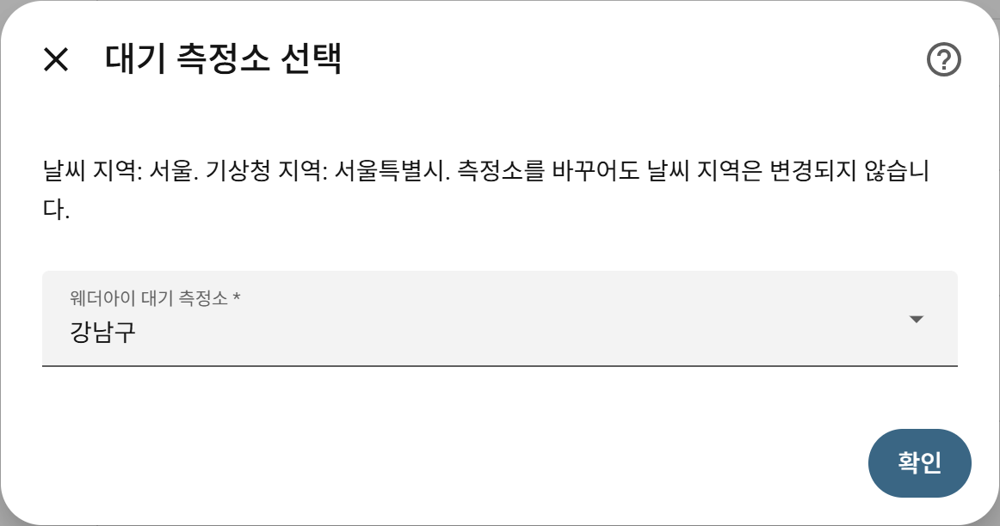

# Korea Weather Fusion for Home Assistant

기상청·네이버·웨더아이의 날씨와 대기질을 합치고, 소스에 문제가 생기면 사용 가능한 다른 정보로 보완합니다.

Combine Korean weather and air quality from KMA, Naver and Weatheri, with available alternatives when a source fails.

[한국어](#한국어) · [English](#english) · [설치하기](#설치) · [대시보드 예시 / Dashboard](docs/dashboard.md)

## 한국어

Korea Weather Fusion은 대한민국 날씨와 대기질 정보를 Home Assistant에서 한눈에
볼 수 있도록 기상청, 네이버 날씨, 웨더아이의 정보를 결합하는 사용자 지정
통합 구성요소입니다.

서울·강남구를 선택한 실제 화면입니다. 기본 **날씨 예보**·**타일** 카드만
사용하며 별도 프런트엔드 설치는 필요하지 않습니다. 표시 값은 조회 시점에 따라
달라집니다. [같은 구성 만들기](docs/dashboard.md#한국어)

### 주요 기능

| 정보 | 표시 방식 |
| --- | --- |
| 현재 날씨·기온·습도·풍속 | 기본 날씨 엔티티와 개별 센서 |
| 미세먼지·초미세먼지 | 최신성과 우선순위에 따라 선택한 통합 값 |
| 오늘·내일 예보 | 실제 날짜가 있는 최고·최저기온 |
| 시간별 예보 | 네이버의 향후 온도·날씨, 3·6·9·12시간 텍스트 센서 |
| 소스 상태 | 정상 / 이전 데이터 사용 / 일부 데이터 없음 / 사용 가능한 데이터 없음 |

한 소스에 문제가 생겨도 다른 정상 소스를 계속 사용합니다. 이전 정보는 유효
시간 안에서만 사용하며, 웨더아이의 유효한 마지막 정보는 재시작 후에도 유지합니다.

### 데이터를 합치는 방법

| 항목 | 선택 방법 | 유효 시간 |
| --- | --- | --- |
| 기온·습도·풍속 | 유효한 네이버와 기상청 값의 평균, 하나만 있으면 그 값 사용 | 2시간 |
| PM10·PM2.5 | 웨더아이 → 기상청 → 네이버 순으로 사용 가능한 값 선택 | 웨더아이 3시간, 나머지 2시간 |
| 오늘·내일 최고·최저 | 네이버 → 웨더아이 순으로 해당 날짜의 값 선택 | 최대 36시간, 날짜도 일치해야 함 |

웨더아이 예보는 자료의 기준일이 오늘이어야 합니다. 시간별 예보와 3·6·9·12시간
텍스트 예보는 네이버에서만 제공하므로 다른 소스로 대체할 수 없습니다. 소스가
없거나 유효 시간을 넘으면 해당 항목을 사용할 수 없는 상태로 표시합니다.

기상청과 네이버의 최신성은 가져온 시각을 기준으로 판단하며, 제공처가 오래된
관측을 다시 보내는 상황을 완전히 감지하지는 못합니다. 웨더아이 대기질은 제공처의
관측 시각을 사용합니다. 진단 정보의 `freshness_basis`에서 이 차이를 확인할 수
있습니다. 선택·제외한 소스와 사유는 각 센서 속성에 표시됩니다.

대표 관측과 텍스트 예보가 모두 없으면 **사용 가능한 데이터 없음**, 일부가 없으면
**일부 데이터 없음**입니다. 필요한 값이 모두 있어도 선택된 소스의 이전 자료를
사용하면 **이전 데이터 사용**으로 표시합니다. 그 밖에 필수 소스 오류가 있으면
**일부 데이터 없음**, 나머지는 **정상**입니다. 네이버 대기질 카드는 선택 사항입니다.
웨더아이의 유효한 자료는 재시작 후에도 복원됩니다.

### 요구 사항

- Home Assistant 2026.3.0 이상
- 기상청, 네이버, 웨더아이 웹사이트에 접속할 수 있는 네트워크

API 키나 별도 계정은 필요하지 않습니다.

### 설치

#### HACS 사용자 지정 저장소

1. HACS에서 **사용자 지정 저장소**를 엽니다.
2. `https://github.com/mahlernim/ha-korea-weather-fusion`을 추가하고 유형으로
   **Integration**을 선택합니다.
3. Korea Weather Fusion을 다운로드하고 Home Assistant를 다시 시작합니다.
4. **설정 > 기기 및 서비스 > 통합 구성 요소 추가**에서 **한국 날씨 통합** 또는
   **Korea Weather Fusion**을 검색하세요.

#### 수동 설치

이 저장소의 `custom_components/weather_fusion` 폴더를 Home Assistant의 같은
경로에 복사한 뒤 Home Assistant를 다시 시작합니다.

#### 기존 사용자 업데이트

HACS에서 업데이트를 다운로드한 뒤 Home Assistant를 다시 시작하세요. 기존
설정과 엔티티 ID는 유지됩니다. 기존 구성 메뉴의 설정은 자동으로 이전되며,
앞으로 위치 변경은 **재구성** 메뉴를 사용하세요.
통합을 삭제하거나 다시 만들 필요는 없습니다.

### 처음 설정하기

**시·도 → 예보 지역 → 대기 측정소 → 소스 확인 → 저장** 순서로 진행합니다.

1. 시·도를 선택한 뒤 목록에서 모니터링할 예보 지역을 선택합니다.
2. 해당 지역에서 사용할 웨더아이 대기 측정소를 선택합니다. 목록 순서는 실제
   거리 순서를 의미하지 않습니다.
3. 지역 확인 화면에서 기상청 지역, 네이버 검색어, 웨더아이 예보 지역과
   대기 측정소를 확인합니다. 각 소스의 연결·필수 데이터·예보 날짜를 검사합니다.
4. 정상인 경우 저장합니다. 일부 소스에 문제가 있으면 실패한 검사만 다시
   시도하거나 지역을 수정하세요. 사용할 수 있는 데이터가 있으면 누락 항목을
   확인하고 **제한 모드**에 동의한 뒤 저장할 수도 있습니다.

 

지역 코드나 검색어를 직접 찾을 필요는 없습니다. 목록에 없는 지역이나 특별한
설정이 필요한 경우에만 **고급 수동 설정**을 선택해 기존의 세부 식별자를 직접
입력할 수 있습니다.

설치 후에는 각 통합 항목의 **재구성** 메뉴에서 위치를 변경하세요. 같은 지역의
기존 사용자 설정은 유지합니다. 소스 확인 화면의 **카탈로그 기본값으로 재설정**을
선택하면 현재 카탈로그 값으로 다시 설정하고 측정소를 선택할 수 있습니다.
예보 지역이 하나인 시·도는 중간 선택을 생략하며, 네트워크 요청 중에는 진행
상태를 표시합니다. 기상청 지역의 † 표시는 시·군 대신 더 넓은 지역을 선택했음을
뜻합니다. 지역 선택에 실패하면 다른 시·도나 고급 수동 설정으로 이동할 수 있습니다.

### 여러 위치 추가하기

집과 사무실을 함께 확인하려면 Korea Weather Fusion에서 **항목 추가**를 선택해
다른 위치를 설정하세요. 저장 전 위치 이름을 지정할 수 있습니다. 각 위치는
별도 기기와 날씨·센서 엔티티를 가지며, 같은 예보 지역에서 다른 측정소를 선택해도
됩니다. 한 위치의 재구성이나 삭제는 다른 위치의 설정과 엔티티에 영향을 주지
않습니다. 위치를 변경해도 해당 항목의 엔티티 ID는 유지됩니다.

고급 수동 설정에도 동일한 소스 검사가 적용됩니다. 네이버 대기질은 선택
소스이므로 해당 카드가 없어도 나머지 필수 검사가 정상이면 저장할 수 있습니다.

### 제공 엔티티

기본 엔티티에는 통합 기온, 습도, 풍속, 미세먼지, 초미세먼지, 오늘·내일
최고/최저기온, 시간대별 텍스트 예보와 데이터 최신 상태가 포함됩니다. 각
제공처의 원본 값은 진단용으로 함께 제공되며, 일부 상세 대기오염 항목은
기본적으로 비활성화되어 있습니다. 기존 엔티티를 삭제하거나 다시 만들 필요는
없습니다.

날씨 엔티티는 현재 날씨와 오늘·내일 최고/최저기온, 네이버가 제공하는 향후
시간별 예보를 제공합니다. 시간별 온도가 없으면 해당 시간은 생략하고, 확인할
수 없는 날씨 상태는 추정하지 않습니다. 일별 예보에는 최고/최저기온만 포함됩니다.
예보 날짜와 시간은 한국 시간을 기준으로 해석합니다.

소스 상태는 **정상**, **이전 데이터 사용**, **일부 데이터 없음**, **사용 가능한 데이터 없음**으로
표시됩니다. 이전 데이터도 유효 시간 내에서만 사용합니다. 상태 엔티티의 속성에서
누락된 관측값과 텍스트 예보를 확인할 수 있습니다.

[기본 카드로 대시보드 만들기](docs/dashboard.md#한국어)를 참고하세요.

### 문제 해결

- 설정 중 오류가 표시되면 지역을 확인하거나 소스 검사를 다시 시도하세요.
  제한 모드에서는 정상 데이터만 제공하며, 소스가 복구되면 자동으로 사용합니다.
  사용할 수 있는 데이터가 전혀 없으면 저장할 수 없습니다.
- 값이 `사용할 수 없음`이면 인터넷 연결과 선택한 지역을 확인하세요.
- 한 제공처의 값만 없으면 해당 제공처의 지역 페이지에서 같은 정보가 보이는지
  확인하세요.
- 네이버가 일부 지역 검색에서 미세먼지 카드를 제공하지 않을 수 있습니다. 이
  경우에도 기상청과 웨더아이 대기질을 이용한 통합 값은 계속 제공됩니다.
- 지역 설정을 수정한 뒤에는 통합구성요소가 자동으로 다시 로드됩니다.
- 웹 제공처의 화면 구조가 바뀌면 일부 값이 일시적으로 제공되지 않을 수
  있습니다. 지속되는 문제는 GitHub Issues에 보고해 주세요.
- 통합 항목에서 진단 정보를 내려받아 문제 보고에 첨부할 수 있습니다. 진단
  파일에는 소스 상태·시간·누락 항목을 포함하고 검색어·정확한 지역·원본 HTML은
  포함하지 않습니다. 문제 보고는 한국어와 영어 모두 가능합니다.

### 개인정보와 한계

Korea Weather Fusion은 입력한 검색어와 지역 식별자를 각 날씨 제공처에 직접
전송합니다. 별도의 중계 서버나 계정 로그인을 사용하지 않습니다. 이 프로젝트는
기상청, 네이버 또는 웨더아이의 공식 제품이 아니며 각 제공처와 제휴하지
않습니다. 제공처 웹페이지의 변경이나 이용 제한에 따라 기능이 달라질 수
있습니다.

---

## English

Korea Weather Fusion is a Home Assistant custom integration for Korean weather and
air quality. It combines data from KMA (`weather.go.kr`), Naver Weather, and
Weatheri into a practical set of everyday entities.

The screenshot above shows real Seoul/Gangnam data using built-in weather and tile
cards. No custom frontend is required. Readings vary with the query time.

### Features

- Combines fresh current temperature, humidity, and wind observations.
- Selects air quality and daily highs/lows using freshness-aware priorities.
- Provides Naver text forecasts for 3, 6, 9, and 12 hours ahead.
- Adds a native weather entity with dated daily and hourly forecasts for standard
  Home Assistant weather cards.
- Exposes source-specific KMA, Naver, and Weatheri diagnostics.
- Keeps healthy sources usable when another source temporarily fails.
- Retains valid Weatheri data across Home Assistant restarts.
- Offers province, forecast-area and air-station dropdowns, then previews actual
  source locations and checks before saving. Air-station changes preserve the
  selected weather area.

### How fusion works

| Metric | Selection | Maximum age |
| --- | --- | --- |
| Temperature, humidity, wind | Mean of valid Naver and KMA values, or the one available value | 2 hours |
| PM10, PM2.5 | First usable value from Weatheri, KMA, then Naver | Weatheri 3 hours, others 2 hours |
| Today/tomorrow high and low | First usable value for the target date from Naver, then Weatheri | 36 hours, also date-validated |

Weatheri forecasts must have today's source date. Hourly and 3/6/9/12-hour text
forecasts are Naver-only, so other sources cannot replace them. A metric becomes
unavailable when no eligible value remains.

KMA and Naver freshness uses fetch time, which cannot reliably detect a provider
serving old observations again. Weatheri air uses the provider observation time.
Diagnostics identify this distinction in `freshness_basis`. Sensor attributes
show selected and rejected sources with reasons.

Status is unavailable when all representative metrics and text forecasts are
missing, and degraded when some are missing. With all capabilities available,
selected cached/error-bearing sources produce cached status. Other required-source
errors produce degraded status, otherwise status is fresh. The Naver PM card is
optional. Valid Weatheri snapshots survive restarts.

### Requirements

- Home Assistant 2026.3.0 or newer
- Network access to KMA, Naver, and Weatheri websites

No API key or separate account is required.

### Installation

#### HACS custom repository

1. Open **Custom repositories** in HACS.
2. Add `https://github.com/mahlernim/ha-korea-weather-fusion` as an **Integration**.
3. Download Korea Weather Fusion and restart Home Assistant.
4. Go to **Settings > Devices & services > Add integration > Korea Weather Fusion**.

#### Manual installation

Copy `custom_components/weather_fusion` from this repository to the same path
under your Home Assistant configuration directory, then restart Home Assistant.

#### Upgrading

Download the update in HACS and restart Home Assistant. Existing settings and
entity IDs remain. Settings from the old Configure menu migrate automatically.
Use **Reconfigure** for location changes. There is no need to delete or recreate
the integration.

### First-time setup

1. Choose a province and forecast area, then a Weatheri air-quality station.
   Station ordering is not a distance ranking.
2. Review the KMA area, Naver query, Weatheri forecast area and air station. The
   integration checks required data, forecast dates and air-quality freshness.
3. Save when ready. If a source fails, retry failed checks or edit the location.
   You can explicitly accept limited mode when some usable data remains; missing
   sources return automatically when they recover.

No location codes or search queries are normally required. Naver air is optional;
its missing card does not prevent saving when the other required checks pass.

Choose **Advanced manual setup** only for an unsupported location or a special
configuration that needs explicit provider selectors. Manual setup uses the same
live validation and review screen.

Use each entry's **Reconfigure** menu to change location. Existing custom selectors
are retained for the same location. Choose **Reset to catalog defaults** on the
review screen to resolve current defaults and select the station again. Provinces
with one forecast area skip that intermediate choice. Network requests show
progress. A † next to the KMA area indicates a broader-area fallback when city
matching failed. The area form offers another province or advanced setup after errors.

### Multiple locations

Choose **Add entry** under Korea Weather Fusion to add another location. Give it a
name before saving, such as Home or Office. Each location has a separate device,
weather entity and sensors. Entries may use the same forecast area with different
air stations. Reconfiguring or deleting one leaves other locations unchanged.
Reconfiguring a location preserves that entry's entity IDs.

### Weather cards and source status

The native weather entity provides current weather, today's and tomorrow's
high/low temperatures, and available future Naver hourly forecasts. Missing hourly
temperatures are omitted; unknown conditions are never guessed. Daily forecasts
contain high/low temperatures only. Provider dates and times are interpreted in
Korea time, including when Home Assistant uses another timezone.

The source-status sensor distinguishes fresh data, valid cached data, degraded
coverage and unavailable data. Its attributes list missing observations and text
forecasts. Existing sensors remain available for dashboards and automations;
there is no need to recreate them.

See the [dashboard example using built-in cards](docs/dashboard.md#english).

### Troubleshooting

- If setup reports an error, check the location or retry failed checks. Limited
  mode requires explicit acceptance and at least some usable data.
- If values are unavailable later, check network access and the selected location.
- If only one source is missing, confirm that source's public location page
  still shows the requested information.
- Naver does not expose its PM card for every local search. KMA and Weatheri air
  quality remain available to the fused entities when that happens.
- Source websites can change their page structure or temporarily limit access.
  Report persistent problems through GitHub Issues.
- Download integration diagnostics for a bug report. They include source status,
  timestamps and missing fields, but omit queries, precise locations and raw HTML.
  Reports in Korean or English are welcome.

### Privacy and limitations

Korea Weather Fusion sends the configured queries and location identifiers directly
to the three weather providers. It uses no relay server and requires no account
login. This independent project is not affiliated with KMA, Naver, or Weatheri.
Availability may change when a provider changes its public website or access
policy.

## License

[MIT](LICENSE)
